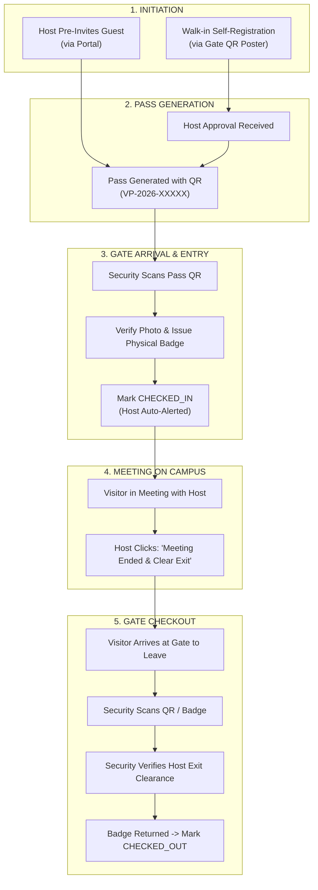

# 🏛️ SmartGate OS — 360° Visitor & Campus Operations Master Blueprint

> **A Comprehensive Operational, Architectural & Security Lifecycle Analysis**  
> *Written from the perspective of all 7 stakeholder roles and visitors: Walk-in Guests, Pre-invited Visitors, Employees (Hosts), Reporting Managers, HR, General Management, Security Gate Guards, and Super Admins.*

---

## 📑 Table of Contents
1. [Executive Summary & Vision](#1-executive-summary--vision)
2. [Past Mistakes & Architectural Lessons Learned](#2-past-mistakes--architectural-lessons-learned)
3. [Remaining Real-World Campus Challenges](#3-remaining-real-world-campus-challenges)
4. [360° Stakeholder Perspective Matrix](#4-360-stakeholder-perspective-matrix)
5. [End-to-End Visitor Journeys](#5-end-to-end-visitor-journeys)
   - [Journey A: Pre-Invitation Flow (Host Initiated)](#journey-a-pre-invitation-flow-host-initiated)
   - [Journey B: Walk-in Gate Self-Registration (Guest Initiated)](#journey-b-walk-in-gate-self-registration-guest-initiated)
   - [Journey C: Gate Arrival, Verification & Entry](#journey-c-gate-arrival-verification--entry)
   - [Journey D: In-Campus Meeting & Host Departure Sign-Off](#journey-d-in-campus-meeting--host-departure-sign-off)
   - [Journey E: Security Gate Checkout & Exit Clearance](#journey-e-security-gate-checkout--exit-clearance)
6. [Host Clearance vs. Security Clearance (Who Does What?)](#6-host-clearance-vs-security-clearance-who-does-what)
7. [The 15 "Small Things" & Edge Cases Solved](#7-the-15-small-things--edge-cases-solved)
8. [Pros & Cons (Trade-Off Analysis)](#8-pros--cons-trade-off-analysis)
9. [Proposed Schema & API Enhancements](#9-proposed-schema--api-enhancements)
10. [Implementation Roadmap](#10-implementation-roadmap)

---

## 1. 🏛️ Executive Summary & Vision

A digital Gate Pass and Visitor Management System (VMS) cannot just be a "contact form with a QR code". In a live enterprise campus (factories, corporate IT parks, manufacturing plants, educational institutions), **the gate is the frontline of physical security, legal compliance, and corporate hospitality**.

A truly resilient system must bridge four distinct physical worlds:
1. **The Guest Outside**: Frustrated on mobile, slow 4G, bright sunlight glare, in a hurry.
2. **The Security Guard at the Boom Barrier**: High pressure, managing truck/car traffic, impatient visitors, needs 5-second check-in.
3. **The Employee/Host in Meetings**: Laptop closed or phone on silent, doesn't want surprise drop-ins.
4. **The Facility & HR Heads**: Require 100% audit accuracy, emergency roll-call headcount during fire alarms, and zero unauthorized persons roaming corridors.

---

## 2. ⚡ Past Mistakes & Architectural Lessons Learned

| # | What Went Wrong Previously | Why It Failed | Lesson & Permanent Solution |
|---|---|---|---|
| **1** | **Hosted Database Out of Sync** | Tables like `Visitor`, `VisitorVisit`, `VisitorPass` were added in Prisma schema locally, but Render deployment ran `prisma generate` and never executed `prisma db push` on production MySQL. | **Automated Startup DDL Engine (`db-sync.service.ts`)**: The backend now auto-detects and runs `CREATE TABLE IF NOT EXISTS` on server boot, guaranteeing hosted databases never miss tables. |
| **2** | **100KB Body Size Wall** | Express defaults `express.json()` to `100kb`. When a visitor captured a high-res selfie or uploaded an ID photo, the Base64 payload exceeded 100KB, throwing an HTTP 413 error. | **Expanded Payload Stream (`limit: '50mb'`)**: Upgraded Express body parser to 50MB with client-side canvas compression to 400x400px JPEG. |
| **3** | **Naive ID Generation Collision** | `generateVisitId()` used `count + 1`. When records were purged or created simultaneously, duplicate keys triggered unique constraint crashes. | **Guaranteed Unique Collision Loop**: Sequential lookup loop that verifies with `findUnique` before issuing IDs (`VIS-2026-XXXXX`). |
| **4** | **Opaque Error Masking** | Catch blocks returned generic text: `"Self-registration failed. Please try again or ask Security."` with zero debugging clues. | **Descriptive Error Telemetry**: Propagate precise error details while logging to immutable audit trails. |
| **5** | **Channel Silo (Web-Only)** | Relying purely on visitor keeping their browser tab open. If mobile restarted, visitor was locked out. | **Omni-Channel Lookup**: Added Mobile Number / WhatsApp / SMS lookup so visitors can retrieve their pass in 2 taps anytime. |

---

## 3. 🚧 Remaining Real-World Campus Challenges

1. **The "Host is in a Meeting" Deadlock**:
   - A visitor self-registers at the gate, but the host is presenting in a boardroom and doesn't see the notification. The visitor is stuck at security for 30 minutes.
2. **The "Who Authorizes Exit?" Ambiguity**:
   - If security lets a visitor out without host confirmation, the company has no record of whether the meeting actually took place, or if the visitor is still somewhere inside stealing IP or wandering unescorted.
3. **Material & Asset Leakage**:
   - Visitors bringing company laptops out or carrying vendor toolkits in. Who signs the material return gate pass?
4. **Group / Delegated Arrivals**:
   - 1 Client arrives with 3 colleagues and 1 driver. Filling 5 separate forms causes a 15-minute bottleneck at the gate.
5. **Re-Entry for Lunch / Smoke Breaks**:
   - Visitor steps out to grab lunch across the street. Should they register all over again, or have a temporary "Pause / Re-entry" gate pass?
6. **No-Show & Overstay Hazards**:
   - Visitor pass was approved for 2 hours, but they have been on campus for 7 hours. Is it an emergency or security incident?

---

## 4. 👥 360° Stakeholder Perspective Matrix

```
┌──────────────────────────────────────────────────────────────────────────────────┐
│                               CAMPUS POPULATION                                  │
├───────────────────────┬──────────────────────────┬───────────────────────────────┤
│ 🚶‍♂️ VISITOR             │ 👤 HOST (EMPLOYEE)       │ 🛡️ SECURITY GUARD             │
│ "Make it fast, clear, │ "Don't interrupt me with │ "I have 5 seconds per vehicle.│
│  no app downloads."   │  strangers; tell me when │  Give me instant green/red    │
│                       │  my meeting has arrived."│  clearance."                  │
├───────────────────────┼──────────────────────────┼───────────────────────────────┤
│ 👨‍💼 MANAGER            │ 👩‍💼 HR DIRECTOR          │ 👑 SUPER ADMIN / FACILITY     │
│ "Notify me if team's  │ "Enforce NDA, conduct,   │ "Real-time live campus head-  │
│  visitors are VIPs    │  and emergency headcount │  count, zero data loss, 100%  │
│  or vendors."         │  safety compliance."     │  audit compliance."           │
└───────────────────────┴──────────────────────────┴───────────────────────────────┘
```

### Detailed Persona Needs:

1. **Visitor (The Guest)**:
   - Needs: Zero login friction, WhatsApp pass delivery, directions to the meeting room, Wi-Fi password access, transparent wait times.
2. **Employee (The Host)**:
   - Needs: 1-click Approve/Reject from mobile notification, meeting arrival alert, ability to sign-off when meeting concludes so visitor can exit.
3. **Security Guard (The Enforcer)**:
   - Needs: High-contrast QR scanner, photo match verification, parking spot allocator, physical badge number logger, fast exit checkout.
4. **Reporting Manager / Department Head**:
   - Needs: Visibility into vendor contractors visiting their department, ability to approve on behalf of juniors if junior is absent.
5. **HR & Safety Compliance Officer**:
   - Needs: Emergency evacuation roll call (instant list of all visitors currently inside buildings), digital visitor NDA sign-off.
6. **Super Admin / Management**:
   - Needs: Analytics (peak arrival hours, average meeting duration, overstay violations, exportable Excel/CSV reports).

---

## 5. 🔄 End-to-End Visitor Journeys



---

### Journey A: Pre-Invitation Flow (Host Initiated)

1. **Host Action**:
   - Employee opens **`Host Dashboard -> Invite Visitor`**.
   - Inputs: Visitor Name, Mobile Number, Email, Organization, Expected Date, Arrival Time, Purpose, Vehicle No (optional).
2. **Dispatch to Visitor**:
   - System auto-generates a pre-approved pass token and sends an SMS/WhatsApp/Email:
     > *"Hello Mr. Sharma, David Chen has invited you to SmartGate Campus on Sept 7 at 10:00 AM. Tap here to view your Digital Gate Pass: `https://smartgate.os/visitor-pass/TOKEN`"*
3. **Visitor Pre-Flight (Self-Check)**:
   - Visitor taps link before arriving; can upload selfie and government ID photo from home.
   - Upon completion, the pass turns **ACTIVE GREEN QR**.
4. **Gate Experience**:
   - Zero waiting. Guest shows QR at security boom barrier -> Guard scans in 3 seconds -> Gate opens.

---

### Journey B: Walk-in Gate Self-Registration (Guest Initiated)

1. **Scan at Gate**:
   - Visitor arrives unannounced at the company entrance.
   - Scans large laminated QR Code poster: *"Welcome to SmartGate — Scan to Check In"*.
2. **Fill Minimal Details**:
   - Form loads on mobile (`/visitor-register`):
     - Step 1: Search & select Host (e.g., "David Chen — Engineering").
     - Step 2: Name, WhatsApp number, purpose, captured selfie.
   - Visitor taps **Submit**.
3. **Real-time Host Radar**:
   - Visitor's screen displays radar pulse: *"Alerting David Chen... Please wait at reception."*
   - Host receives push notification + audio chime: *"Priya Sharma is at Main Gate requesting to meet you for Business Meeting."*
4. **Host Decision**:
   - **Approve**: Instant digital pass generated with QR; visitor phone screen flips to the active pass.
   - **Reject**: Displays polite message: *"Host is currently unavailable. Please check with reception."*
   - **Delegate / Forward**: Host forwards request to a colleague if they cannot attend.

---

### Journey C: Gate Arrival, Verification & Entry

1. **Security Terminal (`/security/visitors`)**:
   - Guard has a tablet/desktop with optical USB scanner or device camera.
2. **Verification Protocol**:
   - Guard scans QR code. System verifies:
     - ✅ Pass status is `APPROVED`
     - ✅ Date matches today
     - ✅ Within valid arrival time window (±60 minutes)
   - Guard verifies visitor's face matches the live selfie on screen.
3. **Badge Allocation**:
   - Guard hands visitor a numbered physical lanyard badge (e.g., `VISITOR-42`) and types `42` into system.
4. **Entry Execution**:
   - Guard taps **"Grant Entry / Check In"**.
   - System updates visit status to `CHECKED_IN`, sets `actualEntryTime = now()`.
   - Host receives instant notification: *"Priya Sharma has entered the campus and is heading to your office."*

---

### Journey D: In-Campus Meeting & Host Departure Sign-Off

> **THE MISSING LINK IN TRADITIONAL SYSTEMS:**  
> Traditionally, nobody tells the security guard when the meeting actually ended. The visitor simply walks to the gate, and security has no idea if the host authorized them to leave.

#### The SmartGate Dual-Signoff Protocol:
1. **Meeting In Progress**:
   - In the Host's portal (`/visitors` or `/dashboard`), an active card shows:
     > 🟢 **Priya Sharma** | On-Campus since 10:15 AM | Meeting in Progress
2. **Meeting Concludes**:
   - When the meeting finishes, the Host opens the card and clicks:
     **"End Meeting & Clear for Gate Exit"** 🏁
   - Host can optionally enter notes (e.g., *"Productive interview, escorting to lobby"*).
3. **Status Transition**:
   - Visit status transitions from `CHECKED_IN` ➔ `CLEARED_BY_HOST_FOR_EXIT`.
   - Visitor's mobile pass screen updates:
     > ✅ *"Meeting Completed. Show this pass at Gate 1 for exit clearance."*

---

### Journey E: Security Gate Checkout & Exit Clearance

1. **Visitor Reaches Gate**:
   - Visitor approaches the security exit turnstile or vehicle boom barrier.
2. **Security Verification**:
   - Guard scans the visitor pass QR code or physical badge number.
   - Security terminal displays:
     - **Host Exit Clearance**: ✅ Cleared by David Chen at 11:45 AM.
     - **Physical Badge**: `#42` to be returned.
     - **Material/Laptops Checked**: Verified.
3. **Execution**:
   - Guard collects physical badge `#42`.
   - Guard taps **"Approve Exit & Check Out"**.
   - System records `actualExitTime = now()`, calculates total stay duration (e.g., *1 hr 32 min*), and marks status as `CHECKED_OUT`.
   - Turnstile / boom barrier opens.
4. **Audit & Thank You**:
   - System sends automated WhatsApp/SMS:
     > *"Thank you for visiting SmartGate Campus, Priya! Have a safe journey."*
   - Full record archived in Immutable Compliance Audit Trail.

---

## 6. ⚖️ Host Clearance vs. Security Clearance (Who Does What?)

To maintain enterprise security without bureaucratic gridlock, permissions are divided into **Operational Clearance** (Host) and **Physical Clearance** (Security Guard):

```
┌───────────────────────────────┬───────────────────────────────┐
│     👤 HOST PERMISSIONS       │    🛡️ SECURITY GUARD          │
│    (Inside the Building)      │      (At Campus Perimeter)    │
├───────────────────────────────┼───────────────────────────────┤
│ • Approves why visitor is on  │ • Checks physical ID & photo  │
│   campus.                     │   match.                      │
│ • Assigns meeting room/dept.  │ • Issues physical lanyard     │
│ • Authorizes guest to leave   │   badge & logs vehicle.       │
│   when meeting concludes      │ • Physically opens gate barrier│
│   ("Host Exit Clearance").    │   for entry and exit.         │
│ • Requests time extension if  │ • Has Emergency Override to   │
│   meeting runs late.          │   clear exit if host forgets. │
└───────────────────────────────┴───────────────────────────────┘
```

---

## 7. 🧩 The 15 "Small Things" & Real-World Edge Cases Solved

### 1. What if Host forgets to click "End Meeting / Clear Exit"?
- **Problem**: Visitor reaches gate to leave, but Host forgot to click the button and is already in another meeting.
- **Solution**: Security Guard terminal has an **"Emergency Guard Exit Override"** button. The guard calls the host extension or enters an override reason (e.g., *"Host verified via phone intercom"*). This logs an audit entry with the Guard's ID for accountability.

### 2. What if Visitor steps out for Lunch and needs to come back?
- **Problem**: Visitor checking out invalidates the pass, forcing them to re-register.
- **Solution**: Security terminal provides a **"Temporary Out / Re-entry"** toggle. Pass remains `TEMP_OUT`. Guard scans them back in upon return without needing host re-approval.

### 3. What if Host is absent or on leave?
- **Problem**: Visitor self-registers for someone who isn't in the office today.
- **Solution**: The public host directory (`/public-hosts`) auto-filters against the `Attendance` and `LeaveRequest` table. Employees currently marked **ON_LEAVE** or **ABSENT** are hidden or tagged with *"Currently Off-Campus (Re-routes to Manager)"*.

### 4. What about Group / Delegation Visitors?
- **Problem**: 1 Vendor arrives with a team of 4 engineers.
- **Solution**: Self-registration supports **"Number of Visitors"** with secondary guest names. One master pass QR covers the group, or generates 4 linked sub-badges under 1 visit ID (`VIS-2026-00001-A`, `-B`, `-C`).

### 5. What if the Internet/WiFi drops at the security gate?
- **Problem**: Boom barrier gate cannot reach cloud API.
- **Solution**: The QR Code payload contains a cryptographically signed HMAC token (`PassNumber|ValidUntil|HostId|Signature`). The Guard's scanner PWA app can verify validity **offline** and sync queued check-in/out timestamps as soon as connectivity resumes.

### 6. Visitor Overstay / "Campus Wandering" Alarm
- **Problem**: Expected exit was 12:00 PM. It is now 1:30 PM and visitor has not checked out.
- **Solution**: The backend automated cron job (`cron.service.ts`) detects overstays, flags the visit as `OVERDUE`, sends an alert to the Host (*"Is your meeting still ongoing?"*), and alerts Security patrols.

### 7. Blacklisted / Restricted Visitors
- **Problem**: Disgruntled former employees or banned contractors attempting entry.
- **Solution**: Blacklist database table matching Mobile Number, Government ID, and Name. If matched, self-registration silently alerts Security and blocks pass generation: *"Please report directly to Main Security Office."*

### 8. Host Delegation / Stand-in Approver
- **Problem**: Host is in a flight/transit when visitor arrives.
- **Solution**: Uses the existing `TemporaryDelegation` engine. If David Chen delegated to Alexander Wright, Alexander receives the approval notification.

### 9. Vehicle & Parking Allocation
- **Problem**: Visitor vehicle parks in Reserved Executive bays.
- **Solution**: Gate Pass includes `vehicleNumber` and `parkingSlot` (e.g., `P2-Slot-14`). Guard verifies license plate before lifting the car boom barrier.

### 10. Digital NDA / Safety Compliance Sign-Off
- **Problem**: Factories require safety gear helmets and legal NDA before entry.
- **Solution**: Before the QR pass activates on the visitor's mobile, a 1-click checkbox: *"I agree to Campus Safety Guidelines and Confidentiality NDA."*

### 11. Lost Physical Lanyard Badge
- **Problem**: Visitor misplaces physical plastic badge inside campus.
- **Solution**: Guard can search visitor by mobile number, unbind old badge, flag badge `#42` as lost, and proceed with exit.

### 12. VIP Fast-Track Entry
- **Problem**: Board members, Government auditors, or VIP clients cannot wait in gate queues.
- **Solution**: VIP Pre-Invite sends VIP Gold Pass. Boom barrier with ANPR (Automatic Number Plate Recognition) or instant 1-second VIP QR beep without requiring photo verification.

### 13. Multiple Hosts in One Day
- **Problem**: Visitor has 10:00 AM meeting with IT, and 2:00 PM meeting with HR.
- **Solution**: System supports **Multi-Leg Visits**. Host 1 clears Leg 1, transferring host custody to Host 2 without visitor leaving the perimeter.

### 14. Delivery Courier / Short Drop-Off Mode
- **Problem**: Amazon / FedEx couriers only need 5 minutes at the reception desk.
- **Solution**: Dedicated **"Delivery Pass"** type with auto-expiry in 15 minutes and gate-restricted perimeter access (Reception Lobby only).

### 15. Emergency Roll Call (Fire / Disaster Headcount)
- **Problem**: Fire alarm triggers. Management needs to know exactly how many non-employees are inside Building B.
- **Solution**: Security and Admin portal provides a 1-click **"Live On-Premise Visitor Manifest"** exportable to mobile with visitor names, mobile numbers, and current host locations.

---

## 8. ⚖️ Pros & Cons (Trade-Off Analysis)

### Modern Web-First Architecture (Current SmartGate OS)

| Dimension | Advantages (Pros) | Disadvantages (Cons) | Mitigation in SmartGate OS |
|---|---|---|---|
| **Zero App Install** | Visitors scan a web QR; zero friction. Works across iOS, Android, laptops, tablets. | Cannot trigger background push notifications if browser is closed. | Automated WhatsApp / SMS pass delivery link and mobile number lookup radar. |
| **Cloud-First Deployment** | Accessible from any gate across multiple campus locations simultaneously. | Dependency on internet connection at the gate. | Edge PWA caching and cryptographic offline QR verification. |
| **Dual Sign-Off Security** | Prevents unescorted visitors roaming without host knowledge. | Requires host to remember to click "End Meeting". | Emergency Guard Override with automated accountability audit logging. |
| **Live Photo Capture** | Eliminates pass sharing / proxy impersonation at the gate. | Uploading large photos over slow 4G. | Client-side HTML5 canvas downsampling to 400x400 JPEG before upload. |

---

## 9. 📐 Proposed Schema & API Enhancements

To fully support the Host Departure Sign-off and Multi-leg workflow, we recommend extending the Prisma schema with the following fields:

```prisma
// Recommended additions to VisitorVisit model:
model VisitorVisit {
  // ... existing fields ...
  
  // Departure Sign-off lifecycle:
  // PENDING_HOST -> APPROVED -> CHECKED_IN -> CLEARED_FOR_EXIT -> CHECKED_OUT
  clearedForExitAt    DateTime?
  clearedByUserId     String?
  hostCheckoutNotes   String?   @db.Text
  
  // Guard Override tracking:
  guardOverrideUsed   Boolean   @default(false)
  guardOverrideReason String?   @db.Text
  
  // Physical Badge & Vehicle:
  physicalBadgeNumber String?   @db.VarChar(50)
  parkingSlotAssigned String?   @db.VarChar(50)
  
  // Material Checklist:
  assetsCarriedIn     String?   @db.Text
  assetsCarriedOut    String?   @db.Text
}
```

### New Dedicated Endpoints:

1. **`POST /api/visitors/visits/:id/clear-exit`** (Host Action)
   - Host confirms meeting is completed and grants permission to leave building.
2. **`POST /api/visitors/visits/:id/guard-override-exit`** (Security Action)
   - Security overrides exit if host is unreachable, capturing reason.
3. **`POST /api/visitors/visits/:id/assign-badge`** (Security Action)
   - Binds physical badge number to visitor session upon entry.
4. **`GET /api/visitors/emergency-manifest`** (Admin & Security)
   - Real-time headcount of every visitor currently inside the campus gates.

---

## 10. 🗺️ Implementation Roadmap

```
┌────────────────────────────────────────────────────────────────────────┐
│ PHASE 1: STABILITY & CORE (COMPLETED ✅)                               │
│ • Production auto-migrations for all 12 MySQL tables                    │
│ • 50MB payload stream for camera selfies                                │
│ • Collision-proof sequential ID & Pass generator                        │
│ • Public Host list & QR Self-Registration functional on Vercel/Render   │
├────────────────────────────────────────────────────────────────────────┤
│ PHASE 2: HOST EXIT CLEARANCE & SECURITY SCANNER (NEXT STEP)            │
│ • "End Meeting & Authorize Gate Exit" button in Host Portal             │
│ • Security Guard checkout scanner verifying host departure status      │
│ • Physical badge number binding on check-in                             │
├────────────────────────────────────────────────────────────────────────┤
│ PHASE 3: ENTERPRISE HARMONIZATION                                      │
│ • Automated WhatsApp Business API gateway integration                   │
│ • Emergency Roll-Call 1-click evacuation headcount                      │
│ • Pre-invitation email template with calendar invite (.ics)            │
└────────────────────────────────────────────────────────────────────────┘
```

---
*Document Version: 2.0.0 — SmartGate OS Enterprise Engineering & Security Architecture*
