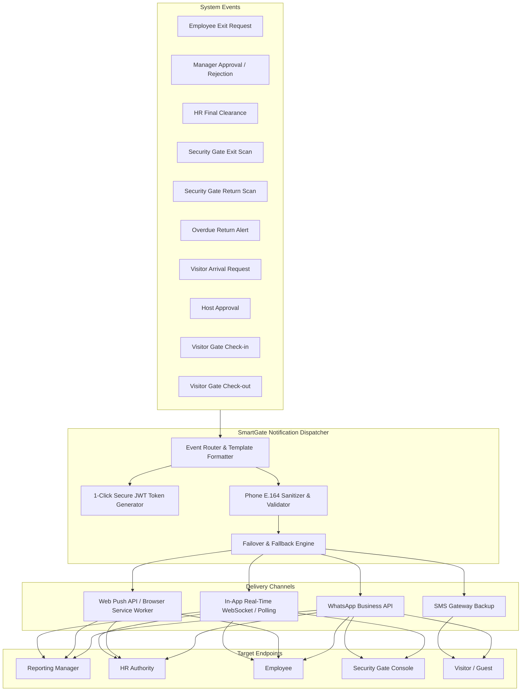
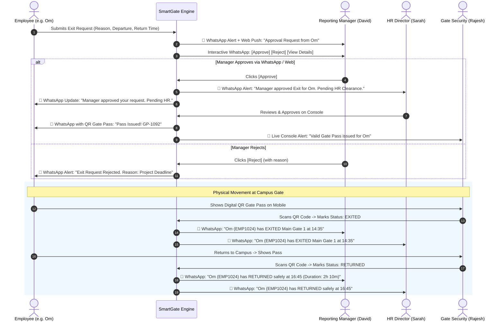
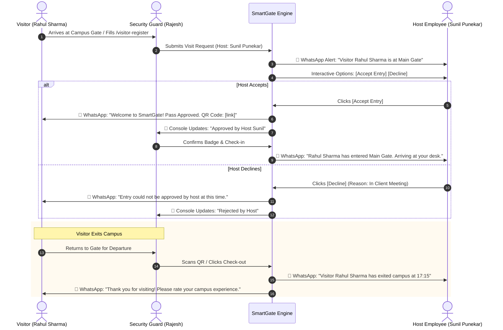

# SmartGate OS: WhatsApp & Enterprise Real-Time Notification Engine Blueprint
**Comprehensive System Specification & Architecture Design**
*Document Version: 1.0.0 — Target Release: SmartGate OS v2.4*

---

## 1. Executive Summary & Objective

In enterprise campus environments, relying solely on web dashboard notifications causes critical operational bottlenecks:
- **Managers and Department Heads** are frequently in meetings, on the factory floor, or traveling, and do not keep a web dashboard open continuously.
- **Employees** waiting at security checkpoints need immediate real-time feedback on their smartphones.
- **External Visitors and Contractors** do not possess internal user accounts and cannot log in to check approval statuses.
- **Security Guards** need instantaneous synchronization between digital gate scans and host authorities.

This blueprint specifies the architecture, data structures, message templates, event triggers, and failover mechanisms for the **SmartGate OS WhatsApp & Omni-Channel Notification Engine**.



---

## 2. Flow 1: Employee Exit Permission & Gate Pass Lifecycle

### 2.1 Complete Step-by-Step Workflow



### 2.2 Detailed Message Templates for Flow 1

#### A. When Employee Submits Exit Request (Sent to Reporting Manager)
- **WhatsApp Recipient**: Connected Reporting Manager (`authorityUser.phone`)
- **Web Push**: Sent to active browser sessions of Manager.
- **Message Content**:
  ```text
  🚪 *SmartGate OS: Exit Permission Request*
  -----------------------------------------
  Dear *David Chen*,
  Your team member *Om Gaikwad* (*EMP1024*) has requested an exit pass.

  📋 *Details:*
  • *Reason:* Client Site Meeting (TCS Hinjewadi)
  • *Type:* Official Duty
  • *Departure:* Today, 02:30 PM
  • *Expected Return:* Today, 05:00 PM (2 hrs 30 mins)

  ⚡ *Quick Actions:*
  👉 Approve: https://smartgate.company.com/api/quick-approve?token={{jwt_token}}&action=APPROVE
  👉 Reject: https://smartgate.company.com/api/quick-approve?token={{jwt_token}}&action=REJECT
  🌐 Open Console: https://smartgate.company.com/authority
  ```

#### B. When Manager Approves (Sent to HR Director)
- **WhatsApp Recipient**: HR Authority (`hrAuthority.phone`)
- **Message Content**:
  ```text
  📋 *SmartGate OS: Exit Pass Pending HR Clearance*
  -----------------------------------------
  Dear *Sarah Jenkins (HR)*,
  Manager *David Chen* has APPROVED an exit request for:

  • *Employee:* Om Gaikwad (EMP1024)
  • *Department:* Engineering
  • *Manager Remark:* "Approved for client presentation."
  • *Departure:* 02:30 PM | *Return:* 05:00 PM

  ⚡ *HR Action:*
  👉 Grant Clearance: https://smartgate.company.com/api/quick-approve?token={{jwt_token}}&action=APPROVE
  🌐 Open HR Console: https://smartgate.company.com/authority
  ```

#### C. When Final Approval is Granted (Sent to Employee)
- **WhatsApp Recipient**: Employee (`employee.phone`)
- **Message Content**:
  ```text
  ✅ *SmartGate OS: Gate Pass Approved!*
  -----------------------------------------
  Hello *Om*,
  Your exit pass has been authorized by *David Chen* and *HR*.

  🎫 *Pass Code:* #GP-2026-8891
  ⏰ *Authorized Window:* 02:30 PM - 05:00 PM
  📍 *Designated Gate:* Main Security Gate 1

  📱 *Your Digital QR Pass:*
  https://smartgate.company.com/gatepass/GP-2026-8891?token={{auth_token}}

  *Note:* Please show the QR code to security guard while exiting and returning.
  ```

#### D. Physical Gate Exit Scan (Sent to Manager & HR)
- **Trigger**: Security Guard clicks "Scan Exit" at Security Gate.
- **WhatsApp Recipients**: Reporting Manager + HR
- **Message Content**:
  ```text
  🚪 *SmartGate OS: Employee Exited Campus*
  -----------------------------------------
  Employee: *Om Gaikwad* (*EMP1024*)
  Gate: *Main Gate 1*
  Security Officer: *Rajesh Kumar*
  Actual Exit Time: *02:38 PM*
  Expected Return Time: *05:00 PM*
  ```

#### E. Physical Gate Return Scan (Sent to Manager & HR)
- **Trigger**: Security Guard clicks "Scan Return" at Security Gate.
- **WhatsApp Recipients**: Reporting Manager + HR
- **Message Content**:
  ```text
  🏢 *SmartGate OS: Employee Returned to Campus*
  -----------------------------------------
  Employee: *Om Gaikwad* (*EMP1024*)
  Gate: *Main Gate 1*
  Actual Return Time: *04:52 PM* (On Time ✅)
  Total Time Outside: *2 Hours 14 Minutes*
  Gate Pass Status: *CLOSED*
  ```

---

## 3. Flow 2: Visitor Entry & Exit Lifecycle

### 3.1 Complete Step-by-Step Workflow



### 3.2 Detailed Message Templates for Flow 2

#### A. Visitor Arrival Request (Sent to Host Employee)
- **WhatsApp Recipient**: Host Employee (`hostUser.phone`)
- **Message Content**:
  ```text
  👤 *SmartGate OS: Visitor at Campus Gate*
  -----------------------------------------
  Dear *Sunil Punekar*,
  A visitor has arrived at Main Gate requesting to meet you:

  • *Visitor:* Rahul Sharma
  • *Company / Org:* Tata Technologies
  • *Phone:* +91 98221 44556
  • *Purpose:* Q3 Project Architecture Review
  • *Vehicle:* MH 12 AB 1234 (Car)

  ⚡ *Authorize Entry:*
  👉 Approve Entry: https://smartgate.company.com/api/visitor-quick-approve?token={{jwt_token}}&action=APPROVE
  👉 Reject Entry: https://smartgate.company.com/api/visitor-quick-approve?token={{jwt_token}}&action=REJECT
  ```

#### B. Visitor Pass Issued (Sent to Visitor's WhatsApp)
- **WhatsApp Recipient**: Visitor (`visitor.phone`)
- **Message Content**:
  ```text
  🎫 *Welcome to Trend Technologies Campus!*
  -----------------------------------------
  Dear *Rahul Sharma*,
  Your host *Sunil Punekar* has approved your campus visit.

  🔑 *Visitor Pass #VP-8041*
  • *Host:* Sunil Punekar (IT & Software)
  • *Allowed Entry:* Today, Valid until 06:30 PM
  • *Entry Gate:* Main Gate 1

  📱 *Your Digital Entry QR Badge:*
  https://smartgate.company.com/visitor-pass/VP-8041

  *Instructions:* Please present this QR code to security at the gate barrier.
  ```

#### C. Visitor Checked-In at Gate (Sent to Host Employee)
- **WhatsApp Recipient**: Host Employee (`hostUser.phone`)
- **Message Content**:
  ```text
  📍 *SmartGate OS: Your Visitor Has Entered Campus*
  -----------------------------------------
  Visitor *Rahul Sharma* has checked in through *Main Gate 1* at *11:15 AM*.
  Badge Number: *B-42*
  They are proceeding to your department (*Floor 2, Engineering Wing*).
  ```

#### D. Visitor Checked-Out at Gate (Sent to Host Employee & Visitor)
- **WhatsApp Recipient 1**: Host Employee
  ```text
  👋 *SmartGate OS: Visitor Departure Notification*
  -----------------------------------------
  Your visitor *Rahul Sharma* (*Tata Technologies*) has checked out through *Main Gate 1* at *04:45 PM*.
  Total Campus Duration: *5 Hours 30 Minutes*.
  ```
- **WhatsApp Recipient 2**: Visitor
  ```text
  🌟 *Thank You for Visiting Trend Technologies!*
  -----------------------------------------
  Dear *Rahul Sharma*,
  Your exit has been recorded at *04:45 PM*. We hope you had a productive visit!

  ⭐ *Rate your visit experience (1-5 stars):*
  https://smartgate.company.com/feedback/VP-8041
  ```

---

## 4. Critical Parameters & Edge Cases (Proactive Technical Analysis)

The following 10 mission-critical parameters and edge cases must be implemented for enterprise reliability:

### 4.1 Meta 24-Hour Messaging Window Rule (HSM Templates)
- **The Constraint**: Meta's WhatsApp Cloud API strictly forbids sending freeform text messages to users who have not sent an inbound message to the business number within the last 24 hours.
- **The Solution**: All system-initiated alerts (e.g. exit approval requests, check-in alerts, gate passes) **must be registered as Pre-Approved WhatsApp Message Templates (HSM)** in the Meta WhatsApp Business Manager:
  - Category: `UTILITY` (Lower cost per message, faster approval).
  - Variable placeholders: `{{1}}`, `{{2}}`, etc.

### 4.2 1-Click Secure JWT Magic Action Links
- **The Problem**: A manager sitting in a conference room or driving should not be forced to open a browser, enter an email, type a password, solve a captcha, and find the right screen to approve an employee's 30-minute exit.
- **The Solution**:
  - The notification includes a cryptographically signed one-time token:
    `POST /api/approvals/quick-action?token=eyJhbGci...&decision=APPROVE`
  - Token is valid for **30 minutes**, bound to specific `requestId` and `managerUserId`.
  - Clicking records the approval directly, invalidates the token, sends immediate WhatsApp confirmation, and triggers the next workflow step without login friction.

### 4.3 Overdue & Late Return Escalation Engine (Automated Cron)
- **The Problem**: If an employee takes an exit pass for 2 hours and does not return, nobody notices until end of day or roll call.
- **The Parameter**:
  - A background cron task runs every 5 minutes checking `GateLog` where:
    `exitStatus == 'EXITED' AND returnStatus == 'PENDING' AND NOW() > expectedReturnTime`
  - Automated Escalations:
    - **T + 15 mins**: WhatsApp reminder to Employee: *"⚠️ Friendly Reminder: Your gate pass expected return time was 05:00 PM. Please proceed to security gate or contact your manager for extension."*
    - **T + 30 mins**: WhatsApp alert to Manager: *"⚠️ OVERDUE NOTICE: Om Gaikwad has not returned to campus (30 mins past scheduled return time 05:00 PM)."*
    - **T + 60 mins**: Marked as `CRITICAL_OVERDUE` on Security Gate dashboard and HR console.

### 4.4 Phone Number Sanitization & E.164 Formatting
- **The Problem**: Indian phone numbers in company databases come in diverse formats:
  - `9876543210`
  - `09876543210`
  - `+91 98765 43210`
  - `919876543210`
- **The Parameter**:
  - Build a strict E.164 normalizer utility before dispatch:
    ```typescript
    export function normalizePhoneNumber(raw: string, defaultCountry = '+91'): string {
      let digits = raw.replace(/[^0-9]/g, '');
      if (digits.length === 10) return `${defaultCountry}${digits}`;
      if (digits.length === 11 && digits.startsWith('0')) return `${defaultCountry}${digits.slice(1)}`;
      if (digits.length === 12 && digits.startsWith('91')) return `+${digits}`;
      if (!raw.startsWith('+')) return `+${digits}`;
      return `+${digits}`;
    }
    ```

### 4.5 Multi-Channel Fallback Matrix (WhatsApp -> SMS -> Web)
- **The Problem**: What if a manager is in a basement with low mobile data, doesn't use WhatsApp on their company SIM, or Meta's API experiences downtime?
- **The Parameter**:
  ```text
  [Event Triggered]
         │
         ▼
  Try WhatsApp API (Timeout: 8s)
         ├──> [Delivered: OK] ──> Log Audit & Done
         └──> [Failed / Undelivered]
                     │
                     ▼
              Fallback to Fast2SMS / Twilio SMS
                     ├──> [Delivered: OK]
                     └──> [Failed]
                               │
                               ▼
                        Deliver In-App Web Alert + Email
  ```

### 4.6 Web Push Notifications (Service Worker API)
- **The Problem**: When staff are working on desktop PCs or laptops, they have their browser open, but the SmartGate tab may be minimized.
- **The Parameter**:
  - Implement Web Push API via Service Worker (`sw.js`).
  - Allows desktop push notifications (pop-ups in Windows Action Center / macOS Notification Center) with sound and click-to-open actions even if the tab is minimized.

### 4.7 Emergency Evacuation Roll Call WhatsApp Broadcast
- **The Problem**: During a fire alarm or emergency evacuation, security needs to know who is inside and who is outside, and notify everyone immediately.
- **The Parameter**:
  - Super Admin & Security Guard have an **"Emergency Evacuation Broadcast"** button.
  - Instantly sends WhatsApp alert to all currently checked-in visitors and all employees currently on campus:
    *"🚨 EMERGENCY EVACUATION: Please proceed immediately to Emergency Assembly Point 2 (North Ground). Do not use elevators."*

### 4.8 Delegation & Out-of-Office Routing
- **The Problem**: If Reporting Manager David is on leave, exit requests sent to him will sit unapproved while the employee is stuck at the gate.
- **The Parameter**:
  - Check `TemporaryDelegation` table. If `fromUserId` is on leave, the notification engine automatically routes the WhatsApp message and approval link to the delegated temporary authority (`toUserId`).

### 4.9 Group Visitor Support
- **The Problem**: A vendor arrives with 4 team members for machinery maintenance under 1 primary booking.
- **The Parameter**:
  - WhatsApp notification to Host lists the primary visitor and total group count: *"Rahul Sharma + 3 technicians"*.
  - QR Code pass allows group check-in/check-out with single scan.

### 4.10 Anti-Spam Notification Throttling & Audit Logging
- **The Parameter**:
  - Every outbound notification is recorded in `NotificationLog` table with:
    `channel`, `recipientPhone`, `templateId`, `status`, `deliveryTimestamp`, `errorMessage`.
  - Rate limiting prevents resending the same notification more than once every 2 minutes unless explicitly forced by user.

---

## 5. Recommended WhatsApp Provider Options

| Provider | Pros | Cons | Best Suited For |
| :--- | :--- | :--- | :--- |
| **Meta Cloud API (Direct)** | Lowest per-message cost; official Direct Graph API; no third-party markup. | Requires Meta Developer App setup & Business verification. | Long-term production enterprise deployment. |
| **Twilio WhatsApp API** | 5-minute setup; unified API for WhatsApp & SMS; sandbox available instantly. | Higher per-message cost (Twilio markup). | Rapid prototyping & global failover. |
| **Gupshup / WATI / UltraMsg** | Highly popular in India; native DLT SMS support; competitive INR pricing. | Proprietary webhooks and API schemas. | Indian SME / Enterprise production. |
| **SmartGate Local Simulator (Mock Mode)** | Zero cost; logs beautiful colored WhatsApp message cards to terminal & web UI; perfect for offline testing. | Development & demo only. | Current local dev & pairing environment. |

---

## 6. Proposed Implementation Roadmap

1. **Phase 1: Architecture & Mock WhatsApp Simulator**
   - Implement `whatsapp.ts` service with automatic phone sanitization, template interpolation, and formatted console/UI demonstration cards.
   - Implement `POST /api/approvals/quick-action` for 1-click tokenized approvals.
2. **Phase 2: Flow 1 (Exit Request & Gate Pass WhatsApp Dispatch)**
   - Wire WhatsApp triggers into Exit Request creation, Manager approval, HR clearance, Security checkout, and Security check-in.
   - Add background Overdue checker cron for automatic late alerts.
3. **Phase 3: Flow 2 (Visitor Entry & Exit WhatsApp Dispatch)**
   - Wire WhatsApp triggers into Visitor registration, Host approval, Gate arrival check-in, and Gate check-out.
4. **Phase 4: Web Push & Production Gateway Connector**
   - Connect live WhatsApp provider credentials (Meta Cloud API / Twilio) via environment variables.
   - Add Browser Service Worker for desktop push notifications.
