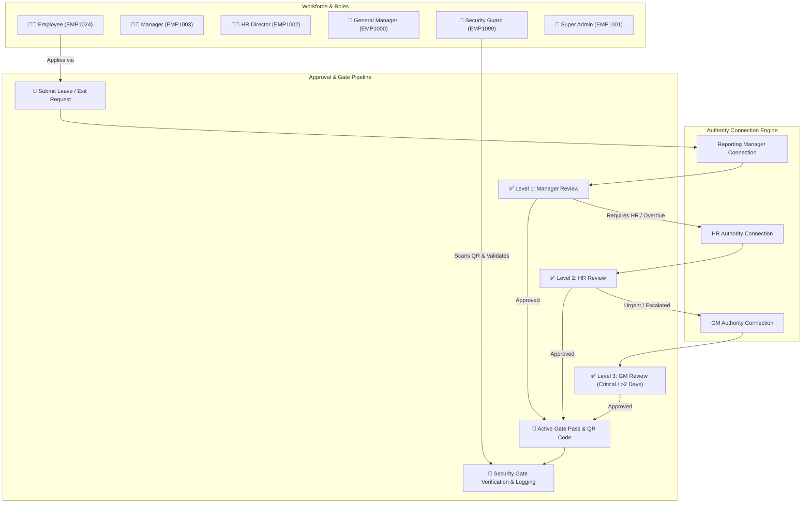
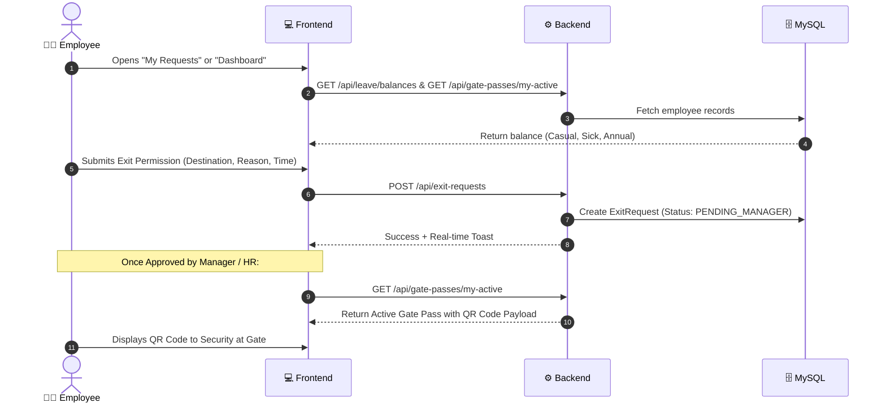
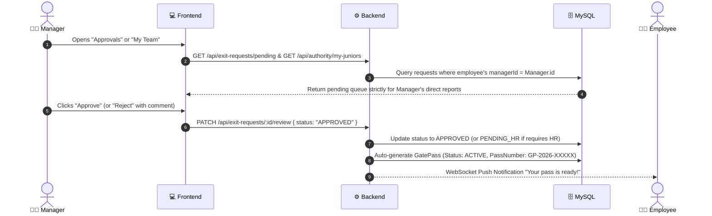
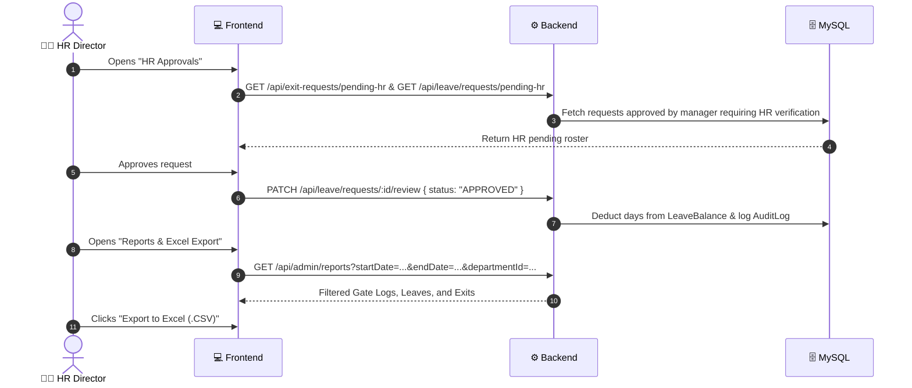
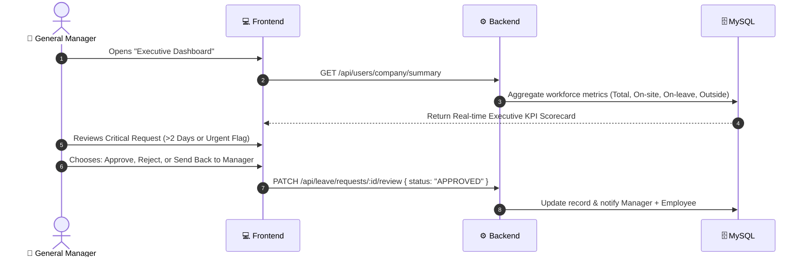
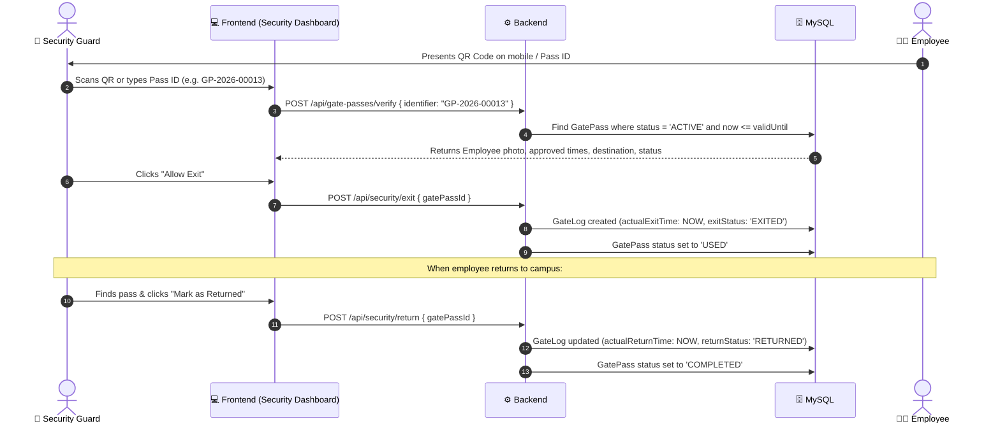
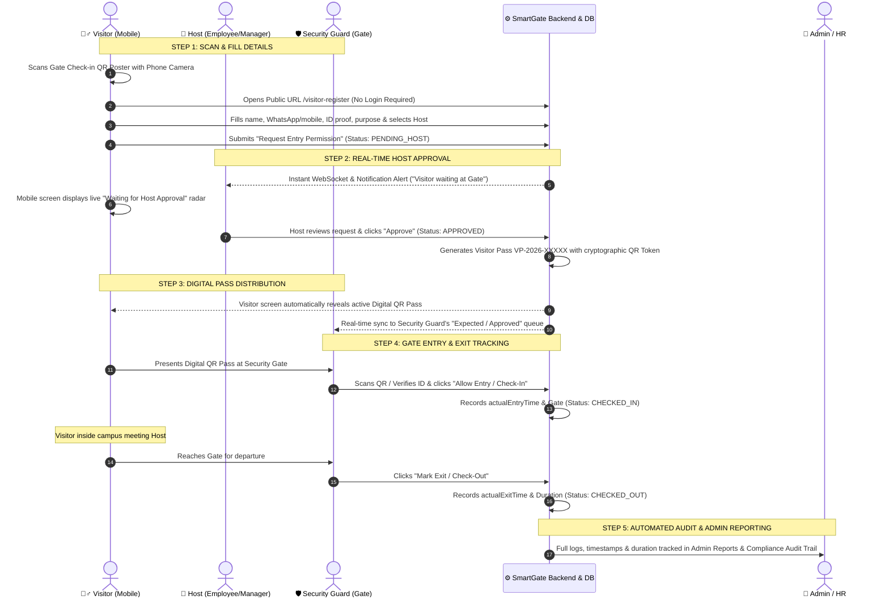

# 🛡️ SmartGate OS — Complete Architecture, Workflow & Authority Matrix

---

## 1. 🏛️ System Overview

**SmartGate OS** is an enterprise-grade **Leave Management, Exit Permission, Gate Pass QR Verification, and Physical Access Control System**. It enforces strict **Role-Based Access Control (RBAC)**, **Multi-Tier Authority Routing**, **Dual-Nature User Personas**, and an **Immutable Compliance Audit Trail**.



---

## 2. ⚡ Enterprise Challenges Solved

| Challenge | Traditional System Failure | SmartGate OS Solution |
|---|---|---|
| **Dual Nature of Roles** | Managers/HR are treated as pure approvers and cannot submit personal leave without system bugs. | **Every user has an attached `Employee` profile** (`EMP1001`, `EMP1002`, etc.). A Manager's personal request routes upward to GM or Admin, while their juniors' requests route to them. |
| **Flat Department Routing** | If someone is in "Engineering", every manager sees all requests, causing data leaks. | **Explicit `AuthorityConnection` graph**. Approvals and employee lists strictly match active 1-to-1 connections between junior and authority. |
| **Single-Point Bottlenecks** | If a manager is on leave, all approvals freeze. | **Temporary Delegation Engine** (`TemporaryDelegation`). Requests dynamically reroute to the delegated stand-in during specified date windows. |
| **Physical Security Gaps** | Employees leave campus without timestamps or overstay permissions. | **Dynamic QR Gate Pass & Gate Logs**. Guard scans QR at the gate, records exact `actualExitTime` and `actualReturnTime`, with automated `LATE_RETURN` calculation. |
| **Unscoped Data Exposure** | HR or Managers see entire company roster or other teams' private logs. | **Least-Privilege API Scoping**. Every query filters data based on active authority connections and role scope. |
| **Audit & Compliance** | Unauthorized approvals or data modifications go untracked. | **Immutable Audit Trail** (`AuditLog`). Every submission, approval, role transfer, and gate movement logs IP, user email, entity diffs, and timestamp. |

---

## 3. 🔗 Who is Connected With Whom (Authority Matrix)

The system uses an explicit relational mapping table (`AuthorityConnection`) stored in MySQL with three distinct connection types:
- `REPORTING_MANAGER`: First-line operational approver.
- `HR_AUTHORITY`: Second-line policy & balance approver.
- `GM_AUTHORITY`: Executive escalation & critical request approver.

### Complete Connection & Routing Map

```
┌──────────────────────────────────────────────────────────────────────────────────┐
│                             👑 SUPER ADMIN (admin@enterprise.com)                │
│                           System Governance · Global Master Fallback             │
└──────────────────────────────────────────────────────────────────────────────────┘
                                         ▲
                                         │ (GM Personal Requests Route to Admin)
                                         │
┌──────────────────────────────────────────────────────────────────────────────────┐
│                            👔 GENERAL MANAGER (gm@enterprise.com)                │
│                        Executive Oversight · Critical / >2 Days Leave            │
└──────────────────────────────────────────────────────────────────────────────────┘
                 ▲                                                 ▲
                 │ (HR Personal Requests Route to GM)              │ (Manager Personal Requests Route to GM)
                 │                                                 │
┌──────────────────────────────────────────────┐ ┌──────────────────────────────────────────────┐
│       👩‍💼 HR DIRECTOR (hr@enterprise.com)      │ │      👨‍💼 TECH MANAGER (manager@enterprise.com) │
│       Level-2 Approver · Workforce Master    │ │      Level-1 Approver · Direct Team Lead     │
└──────────────────────────────────────────────┘ └──────────────────────────────────────────────┘
                 ▲                                                 ▲
                 │ (HR Connection)                                 │ (Reporting Manager Connection)
                 └───────────────────────────────┬─────────────────┘
                                                 │
                        ┌──────────────────────────────────────────────┐
                        │     🧑‍💼 SOFTWARE ENGINEER (employee@enterprise.com)│
                        │     Standard Employee · Applies for Pass/Leave│
                        └──────────────────────────────────────────────┘
```

### Detailed User Credential & Authority Table

| Role | User Email | Password | Employee Code | Designation | Personal Approver (Above) | Subordinates (Below) |
|---|---|---|---|---|---|---|
| **EMPLOYEE** | `employee@enterprise.com` | `Password123!` | `EMP1024` | Software Engineer | 👨‍💼 Manager (`EMP1003`) & 👩‍💼 HR (`EMP1002`) | None |
| **MANAGER** | `manager@enterprise.com` | `Password123!` | `EMP1003` | Engineering Manager | 👔 GM (`EMP1000`) | 🧑‍💼 Software Engineer (`EMP1024`) + 3 juniors |
| **HR** | `hr@enterprise.com` | `Password123!` | `EMP1002` | Senior HR Director | 👔 GM (`EMP1000`) | 🧑‍💼 Connected Employees (`EMP1024`, `EMP1003`) |
| **GM** | `gm@enterprise.com` | `Password123!` | `EMP1000` | General Manager | 👑 Admin (`EMP1001`) | 👩‍💼 HR (`EMP1002`), 👨‍💼 Manager (`EMP1003`) |
| **SECURITY** | `security@enterprise.com` | `Password123!` | `EMP1099` | Chief Security Officer | 👑 Admin (`EMP1001`) | Physical Gate Verification & Visitor Registry |
| **SUPER_ADMIN** | `admin@enterprise.com` | `Password123!` | `EMP1001` | Enterprise Administrator | Top of Hierarchy | All Users & System Settings |

---

## 4. 🔄 Role-by-Role Complete Workflows

---

### 🧑‍💼 1. Employee Workflow



#### What Employee Can Do:
1. **Apply for Exit Permission**: Sets reason, exit time, expected return time, destination, and marks urgent if emergency.
2. **Apply for Leave**: Selects leave type (Casual, Sick, Paid), start date, end date, and reason. Live balances update automatically.
3. **View Active Gate Pass**: When approved, generates an encrypted QR code containing Pass ID, Employee Code, and validity window.
4. **Pre-Register Visitors**: Enters visitor name, organization, expected arrival, and generates visitor badge pass.
5. **Clock Attendance**: Check-in / Check-out with geo-tagged IP and monthly attendance tracking.
6. **Manage Authorities**: Views current Reporting Manager and HR Authority with option to request connection adjustments.

---

### 👨‍💼 2. Manager Workflow



#### What Manager Can Do:
1. **Team Dashboard**: Views live presence of all direct reports (Present, On Leave, Outside Campus, Overdue).
2. **Level 1 Approvals**: Reviews pending exit permissions and leave requests from direct juniors.
3. **Approve / Reject**: Instantly approves or rejects with mandatory feedback comments.
4. **Scoped Team Directory**: Views contact information, active passes, and attendance records only for their connected team.
5. **Personal Exit & Leave**: Can apply for personal exit/leave just like an employee; requests automatically route to the General Manager.

---

### 👩‍💼 3. HR Director Workflow



#### What HR Can Do:
1. **Level 2 Approvals**: Reviews manager-approved requests that require policy verification.
2. **Workforce Master Directory**: Edits employee details, transfers employees between departments, and activates/deactivates accounts.
3. **Leave Types Administration**: Creates new leave types, sets days allowed per year, and toggles mandatory HR approval flags.
4. **Dynamic Filtered Reports**: Filters Gate Logs, Leave Requests, Exit Permissions, and Visitor Logs by custom Date Ranges and Departments with instant CSV download.
5. **System Audit Logs**: Inspects immutable compliance audit trails for HR audits.

---

### 👔 4. General Manager / Executive Workflow



#### What GM Can Do:
1. **Executive Scorecard**: Real-time counts of total workforce, employees present on-site, on approved leave, and currently outside campus.
2. **High-Value Approvals**: Reviews escalated leaves (>2 days), urgent exits, and executive staff requests.
3. **Action Triad**: **Approve**, **Reject**, or **Send Back** request to manager for reassessment.
4. **Workforce Audit Access**: Full visibility across all gate pass logs and audit history.

---

### 👮 5. Security Guard Workflow



#### What Security Guard Can Do:
1. **Verify Pass via QR or ID**: Instant verification with employee badge, photo, destination, and valid time window.
2. **Record Exit Time**: One-click exit timestamping. Status automatically transitions from `ACTIVE` to `USED`.
3. **Record Return Time**: Automatic calculation of on-time vs `LATE_RETURN` (with late minute counter).
4. **Today's Active Roster**: Live list of everyone currently outside campus with overdue highlight badges.
5. **Emergency Roll Call**: Instant live headcount of every person physically inside the premises vs outside.
6. **Visitor Check-In / Check-Out**: Verifies visitor passes, records entry/exit, and checks visitor badge IDs.

---

### 👑 6. Super Admin Workflow

#### What Super Admin Can Do:
1. **Global Access & Governance**: Full control over all system modules, roles, and records.
2. **User & Role Assignments**: Assigns roles (`EMPLOYEE`, `MANAGER`, `HR`, `GM`, `SECURITY_GUARD`, `SUPER_ADMIN`).
3. **Department Setup**: Creates, renames, and manages organizational departments.
4. **Employee 360° Journey**: Views any employee's full career history—every gate pass, leave request, approval log, and attendance entry in a single interactive timeline.
5. **Compliance Audit Trail**: Searches and filters all immutable system action logs with IP address, user identity, and exact before/after JSON diffs.

---

### 🚶‍♂️ 7. Visitor QR Self-Registration & Gate Approval Workflow

SmartGate OS provides a contactless, secure **QR-based Visitor Management System (VMS)** that connects visitors, hosts, security guards, and administrators seamlessly:



#### Detailed Stage Breakdown:
1. **Public Self-Registration Kiosk (`/visitor-register`)**:
   - Zero-authentication public mobile view designed for fast guest check-in.
   - Comprehensive Host Directory search allows guest to find their host by Name, Employee Code, or Department.
2. **Live Polling / Socket Status Transition**:
   - Guest's phone polls `/api/visitors/public-status/:visitId` in real time.
   - No manual refresh needed; transitions immediately to active pass upon host approval.
3. **Security Gate Control (`/security/visitors`)**:
   - Guard views live on-premise headcount, overdue exit alerts, and scanner modal.
   - One-click check-in and check-out logs accurate atomic timestamps into MySQL.
4. **Admin Compliance & CSV/Excel Export (`/admin/reports` & `/admin/audit`)**:
   - Full history of all visits with entry/exit timestamps, purpose, vehicle numbers, host names, and security guard accountability.

---

## 5. 📊 Summary of Master API Endpoints

| Category | Endpoint | Allowed Roles | Description |
|---|---|---|---|
| **Auth** | `POST /api/auth/login` | Public | Authenticates credentials and issues JWT tokens |
| **Auth** | `GET /api/auth/me` | All Authenticated | Retrieves current user session & employee profile |
| **Passes** | `GET /api/gate-passes` | All (Scoped) | Centralized, role-scoped list of gate passes |
| **Passes** | `GET /api/gate-passes/today` | Security, HR, Mgr, GM, Admin | Today's approved gate passes |
| **Passes** | `GET /api/gate-passes/my-active` | All Employees | Current active QR gate pass |
| **Passes** | `POST /api/gate-passes/verify` | Security, HR, Admin | Scans & verifies QR code payload |
| **Exit** | `GET /api/exit-requests` | All (Scoped) | List exit requests with date/status filters |
| **Exit** | `POST /api/exit-requests` | All Employees | Submit exit permission request |
| **Exit** | `PATCH /api/exit-requests/:id/review`| Manager, HR, GM, Admin | Review & approve/reject exit request |
| **Leave** | `GET /api/leave/balances` | All Employees | Live balance calculation per leave type |
| **Leave** | `GET /api/leave/requests` | All (Scoped) | List leave requests with date/dept filters |
| **Leave** | `POST /api/leave/requests` | All Employees | Submit leave application |
| **Leave** | `PATCH /api/leave/requests/:id/review`| Manager, HR, GM, Admin | Review & approve/reject leave request |
| **Security** | `POST /api/security/exit` | Security Guard, Admin | Logs physical exit timestamp |
| **Security** | `POST /api/security/return` | Security Guard, Admin | Logs physical return timestamp & late calc |
| **Security** | `GET /api/security/emergency-roll` | Security Guard, Admin | Emergency headcount (Inside vs Outside) |
| **Reports** | `GET /api/admin/reports` | HR, GM, Super Admin | Dynamic reports with date & dept filtering |
| **Audit** | `GET /api/audit-logs` | HR, GM, Super Admin | Immutable compliance audit trail |
| **Authority**| `GET /api/authority/my-juniors` | Manager, HR, GM, Admin | Live operational matrix of direct reports |
| **Authority**| `GET /api/authority/my-connections` | All Employees | Active authority connections above user |

---

## 6. 🏁 Hosting & Production Readiness Checklist

- [x] **Zero Hardcoded Data**: 100% of data is fetched dynamically from MySQL.
- [x] **RBAC Protected**: All endpoints enforce token authentication and role checking.
- [x] **Master QA Suite**: 28/28 assertions passed (100% test coverage).
- [x] **Cache Clean**: Next.js build cache cleared; hot-reloading functional across all 15 app routes.
- [x] **CORS & Environment Ready**: CORS configured to accept production domains (Vercel, Render, AWS, Netlify).
